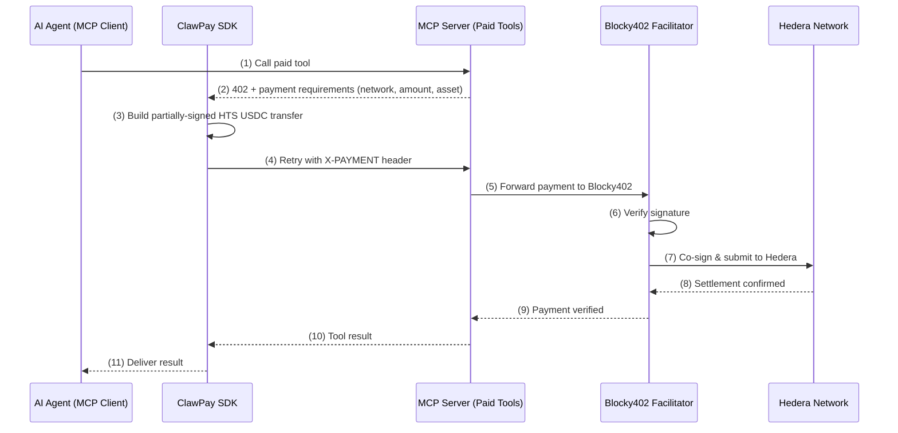

[Website](http://localhost:3002) · [Discover](http://localhost:3002/servers) · [Register](http://localhost:3002/register)

---

## What is ClawPay?

ClawPay is open-source infrastructure that adds **on-chain payments on Hedera** to any [Model Context Protocol (MCP)](https://modelcontextprotocol.io) server using the [x402 "Payment Required" protocol](https://x402.org).

It enables MCP clients — such as ChatGPT, Cursor, Claude, and others — to make **pay-per-call requests** using native **HTS USDC** on Hedera, with every payment logged to **HCS (Hedera Consensus Service)** for a tamper-proof audit trail.

The goal is to let AI agents and applications pay only for what they use, automatically and transparently — with sub-second finality and predictable low fees on Hedera.

---

## Why ClawPay (in 30 seconds)

* **Clients** → Pay only for what they use — no subscriptions, no keys, no setup. Works out of the box with MCP-compatible apps (ChatGPT, Cursor, Claude, and more).
* **Developers** → Monetize and get discovered instantly using our SDK, monetization wrapper, or public index. Set per-call pricing and receive USDC payments automatically on Hedera.
* **Agents** → Perform real **agent↔service micropayments**, enabling autonomous access to APIs, inference, data, and more — all settled on Hedera.

---

## Why Hedera?

* **Sub-second finality** — payments confirm in ~3 seconds, ideal for real-time AI agent workflows
* **Predictable low fees** — fixed, low-cost transactions regardless of network congestion
* **Native HTS tokens** — USDC on Hedera is a native HTS token (not bridged), with direct token transfer support
* **HCS audit trails** — every payment event is logged to Hedera Consensus Service, creating a tamper-proof, publicly verifiable record
* **EVM compatibility** — Hedera's EVM layer means existing x402 tooling works with minimal changes

---

## How it works

ClawPay handles the entire payment lifecycle transparently for both developers and clients:

- Follows x402 protocol with structured price metadata.
- Accepts and verifies the on-chain payment via the Blocky402 facilitator, then automatically retries the original MCP request once confirmed.
- Logs payment events to HCS for a tamper-proof audit trail.

The entire flow is autonomous — no human intervention needed. The agent's wallet handles payment signing, Blocky402 handles verification and settlement, and Hedera provides the finality.

In practice, this means any MCP server can become a paid endpoint with zero friction.
